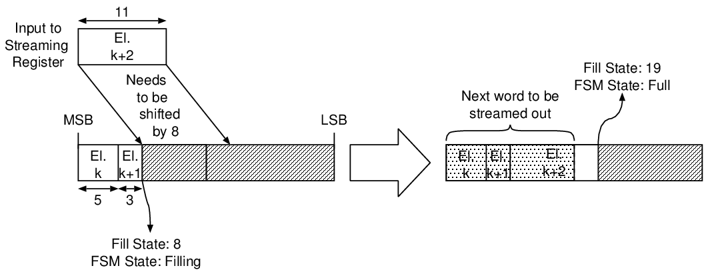
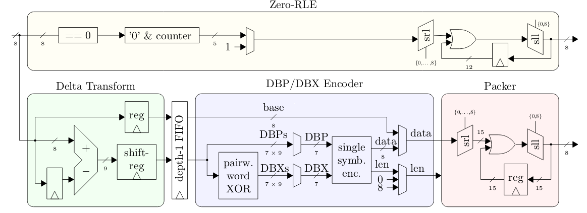
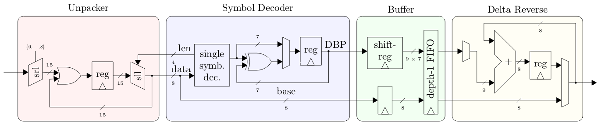
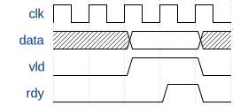
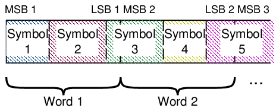

Copyright (c) 2019 ETH Zurich, Georg Rutishauser, Lukas Cavigelli, Luca Benini

# Extended Bit-Plane Compression Hardware Architecture

This repository contains the open-source release of the hardware
implementation of the **Extended Bit-Plane Compression** scheme described in the
paper "[EBPC: Extended Bit-Plane Compression for Deep Neural Network Inference
and Training Accelerators](https://arxiv.org/abs/1908.11645)". Two top-level modules are provided: An encoder and
a decoder. The implementation language is SystemVerilog.

If you find this work useful in your research, please cite

    @article{epbc2019,
      title={{EBPC}: {E}xtended {B}it-{P}lane {C}ompression for {D}eep {N}eural {N}etwork {I}nference and {T}raining {A}ccelerators},
      author={Cavigelli, Lukas and Rutishauser, Georg and Benini, Luca},
      year={2019}
    }
    @inproceedings{cavigelli2018bitPlaneCompr,
      title={{E}xtended {B}it-{P}lane {C}ompression for {C}onvolutional {N}eural {N}etwork {A}ccelerators},
      author={Cavigelli, Lukas and Benini, Luca},
      booktitle={Proc. IEEE AICAS}, year={2018}
    }

The Paper is available on arXiv at [https://arxiv.org/abs/1908.11645](https://arxiv.org/abs/1908.11645).

The code to reproduce the non-hardware experimental results is available at <https://github.com/lukasc-ch/ExtendedBitPlaneCompression>.

# Table of Contents

1.  [Extended Bit-Plane Compression Hardware Architecture](#orgfc927a5)
    1.  [Architecture](#orgefa27d8)
    2.  [Operation](#org80ebfbb)
    3.  [Python Environment](#org4cf7855)
    4.  [Simulating the Designs with cocotb](#orgc0e499a)
    5.  [Simulating the Designs with the RTL TBs](#org56a2075)
    6.  [Contact](#org5cdeefa)

## Architecture

The variable-length nature of the encoding means that the hardware needs to
concatenate words of variable lengths. This is achieved by using "streaming
registers" and barrel shifters, which make up most of the logic resources
the implementation takes up. A streaming register is a register of twice
the word width of the streamed words. Variable-length data items are placed
in the streaming register from the MSB downwards. If the streaming register
is already partially filled, further items must thus be logically
right-shifted in order not to overwrite with the contents already present.
This process is illustrated [the following figure](#org71a3fa7). Once a streaming register
is full, no more items can be added until the upper half is streamed out. At
this point, the contents of the lower half must be left shifted by a word
width (in the example, 16 bits).

### Encoder

The encoder takes a stream of input words and outputs two streams: 

-   A **BPC Stream** of the encoded non-zero input words
-   A **ZNZ Stream** of the zero runlength (ZRL) encoded zero/nonzero (ZNZ)
    stream

Along with the input words, the encoder takes a signal `last_i` indicating whether
the word that is currently being input is the last word of a transmission.
This will cause the encoder to flush the BPC and ZRL encoders.

### Decoder

 
The decoder is fundamentally a dual of the encoder -
it takes as its inputs the BPC and ZNZ streams produced by the encoder and
streams out the decoded words. To prevent outputting the zero-padding added
in the encoding process, it must also know the number of unencoded words in
the transmission.

### Interfaces

Inputs and outputs are transmitted with **valid/ready** handshake interfaces,
illustrated in the following figure. A transaction occurs on rising clock
edge where the ready signal from the consumer and the valid signal from the
producer are high. Generally, a producer is not allowed to deassert the
valid signal before the corresponding transaction has been completed, i.e.
before the consumer has asserted its valid signal. The word width of input
words and output words is always equal.

### Parameters

All architecture parameters are defined in the `src/ebpc_pkg.sv` file:

<table border="2" cellspacing="0" cellpadding="6" rules="groups" frame="hsides">

<colgroup>
<col  class="org-left" />

<col  class="org-left" />

<col  class="org-left" />
</colgroup>
<thead>
<tr>
<th scope="col" class="org-left">Parameter</th>
<th scope="col" class="org-left">Function</th>
<th scope="col" class="org-left">Tested Values</th>
</tr>
</thead>

<tbody>
<tr>
<td class="org-left">`LOG_DATA_W`</td>
<td class="org-left">log2ceil of the word width of the input/output data streams</td>
<td class="org-left">3, 4</td>
</tr>
</tbody>

<tbody>
<tr>
<td class="org-left">`BLOCK_SIZE`</td>
<td class="org-left">Bit plane compression block size</td>
<td class="org-left">8, 16</td>
</tr>
</tbody>

<tbody>
<tr>
<td class="org-left">`LOG_MAX_WORDS`</td>
<td class="org-left">log2ceil of the maximum number of uncompressed words in a single transmission</td>
<td class="org-left">24</td>
</tr>
</tbody>

<tbody>
<tr>
<td class="org-left">`LOG_MAX_ZRLE_LEN`</td>
<td class="org-left">log2ceil of the maximum length of a zero runlength encoding block</td>
<td class="org-left">4</td>
</tr>
</tbody>
</table>

#### Constraints on parameters

-   `DATA_W` = `2^LOG_DATA_W` >= `BLOCK_SIZE`
-   `LOG_DATA_W` >= `3`

## Operation

### Encoder

1.  Stream in the data to be encoded with the `data_i`, `last_i`, `vld_i`,
    `rdy_o` interface. When the last word is transmitted, assert `last_i`.
2.  In parallel, read the output streams:
    -   **ZNZ Stream**: `znz_o`, `znz_vld_o`, `znz_rdy_i`.
    -   **BPC Stream**: `bpc_o`, `bpc_vld_o`, `bpc_rdy_i`.
3.  When `idle_o` is asserted (after `last_i` was asserted, i.e. input
    streaming has finished), output streaming has concluded and the next
    input transmission may begin.

#### Padding

The last word of the ZNZ stream will be zero-padded. The input to the
internal BPC encoding block will be stuffed with zeros to a full block
size, i.e. if the number of nonzero words in the input stream is not
divisible by the block size, zero words will be inserted.

### Decoder

1.  Tell the block number of words to expect in the decoded transmission:
    `num_words_i`, `num_words_vld_i`, `num_words_rdy_o`.
2.  Stream in the encoded words:
    -   **ZNZ Stream**: `znz_i`, `znz_vld_i`, `znz_rdy_o`.
    -   **BPC Stream**: `bpc_i`, `bpc_vld_i`, `bpc_rdy_o`.
3.  In parallel, read the decoded output stream:
    `data_o`, `vld_o`, `rdy_i`, `last_o`.
    `last_o` will be asserted on the last output word. The next transmission
    may only be started after `last_o` has been asserted.

### Encoded Stream Format

BPC encoding is a variable-length encoding scheme and the encoded symbols
are packed into words, so the encoded stream looks like this:

## Python Environment

A conda environment YAML file is provided in the `py` folder. It specifies all the python packages needed
to simulate the designs with cocotb, generate stimuli etc. To use it, you will need Anaconda3/Miniconda3.
From the `py` folder, type the following command to create an environment called `stream-ebpc`:

    conda env create -n stream-ebpc -f environment.yml

## Simulating the Designs with cocotb

Our testbenches are written in Python using [cocotb](https://github.com/cocotb/cocotb). There are testbenches
supplied for 4 design entities in the `tb` folder:

-   `bpc_encoder` - this block performs bit-plane encoding on the input stream
-   `ebpc_encoder` - this top-level encoder block combines the BPC encoder and
    a zero runlength encoder
-   `bpc_decoder` - this block decodes a stream of bit-plane encoded data
-   `ebpc_decoder` - this top-level decoder block combines the BPC decoder
    block with a zero runlength decoder.

Makefiles are supplied for each testbench, along with wave view scripts for
Mentor Graphics QuestaSim. The makefiles set the cocotb environment variable
`SIM_ARGS` with QuestaSim-specific options, so for use with another simulator
they will have to be adjusted slightly. To step-debug the testbenches with
[PyCharm](https://www.jetbrains.com/pycharm/), copy the Pycharm debug egg (`pydevd-pycharm.egg`) to the `tb`
folder, uncomment the line in the Makefile augmenting the `PYTHONPATH`
environment variable and uncomment the lines in the testbench file that look
like this:
`#import pydevd_pycharm`
`#pydevd_pycharm.settrace('localhost', port=9100, stdoutToServer=True, stderrToServer=True)`
Follow the [guide](https://www.jetbrains.com/help/pycharm/remote-debugging-with-product.html) by JetBrains to set up remote debugging. You will need
PyCharm Professional for this to work.

### Feature Map Tests

The EBPC encoder testbench contains a (commented-out) test (`fmap_inputs`) which can be used to
automatically generate intermediate feature maps of a variety of networks, as defined in the
`data.getModel` function and feed them to the compressor hardware. The python code uses the popular
[PyTorch](https://pytorch.org/) library. To run the tests, you will have to download a dataset of your choice
(e.g. the ImageNet validation set). The code uses the TorchVision `ImageFolder` data loader, which expects
the images to be located in folders corresponding to their labels. Thus, `IMAGE_LOCATION` in
`ebpc_encoder_tests.py` needs to be set to the parent folder containing only a subfolder which in turn
contains the images. Note that even just a single images produces massive amounts of stimuli data, so only
a fraction of the feature maps are actually fed to the hardware (the fraction can be changed with the
`FMAP_FRAC` variable).

## Simulating the Designs with the RTL TBs

In the `rtl_tb` folder, there are file-based testbenches for the EBPC encoder and decoder. Compilation and
simulation scripts for Mentor QuestaSim and Cadence IUS (unsupported) are included. To simulate the designs
using these file-based testbenches, you will need to perform 3 steps:

1.  Adapt the `CADENCE_IUS` or `QUESTA_VLOG` and `QUESTA_VSIM` variables in the `compile_sim_{design}.sh`
    scripts to your system - usually, the appropriate values are `xrun`, `vlog` and `vsim` respectively.
2.  Generate stimuli using the python script in the `py/stimuli_gen` folder. It can be configured to
    generate feature map stimuli from various networks, using a configurable fraction of the feature maps
    (using all feature maps would result in excessive file sizes and simulation times). Edit the script to
    configure parameters such as `BASE_STIM_DIRECTORY` (where stimuli files are stored), `NETS` (which nets
    are used to extract feature map stimuli - `random` and `all_zeros` are also valid options) etc.
3.  configure the correct stimuli file paths in the `ebpc_encoder_tb.sv` and `ebpc_decoder_tb.sv` files in
    the `rtl_tb` subfolders.

If any issues arise, do not hesitate to contact us.

## Contact

For information or in case of questions, write a mail to [Georg Rutishauser](mailto:georgr@iis.ee.ethz.ch).
If you find a bug, don't hesitate to open a GitHub issue!

